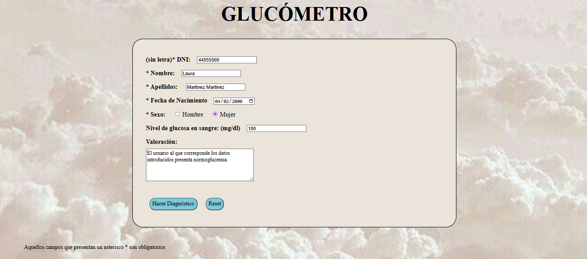

# glucometer
This project is a simple but functional **web-based glucose tracking tool**, developed entirely with **HTML and basic client-side logic**. Users can input personal and medical data to monitor blood glucose levels and receive automatic classification feedback.

## 💡 What does the project do?
- Users fill out a form with:
  - DNI (without the letter)
  - First name and last name
  - Date of birth
  - Sex
  - Blood glucose level (mg/dL)

- Once submitted:
  - The entry is stored in a visible **registry of records**.
  - The page displays the **glycemic status** based on the glucose level:  
    - **Hypoglycemia**,  
    - **Normoglycemia**, or  
    - **Hyperglycemia**

- The criteria used for classification are clearly explained on the web page itself.

## 🛡️ Validation and Error Handling

- **DNI** must be numerical and within a valid range.
- **Date of birth** must follow a valid format and be logical (no future dates, etc.).
- **Glucose levels** must be positive numbers.
- If any field is invalid, the form will not submit and feedback will be shown to the user.

## 🌐 Technologies Used

- **HTML5** – Web structure and form
- **CSS (optional)** – For styling (if included)
- **Basic JavaScript or HTML validation attributes** – For client-side validation logic

> ⚠️ No backend is used – the registry and validation happen in the front-end only.

## 🚀 How to Use

1. Open the `index.html` file in a web browser.
2. Fill in all fields with valid data.
3. Submit the form.
4. See the entry added to the registry and check the glucose status.

## 📚 Academic Project
Academic project developed during the Bachelor's Degree in Biomedical Engineering.
Subject: Clinical Systems Infraestructure
Author: Esther Bermejo Martinez
